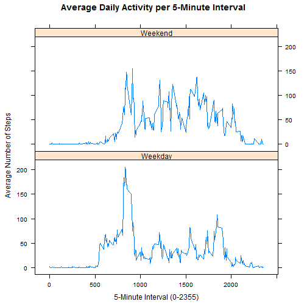

Before loading data, verify needed packages are ready to use. Messages are 
displayed in case there are issues.


```r
if(!require(dplyr)) { # load dplyr if not already available
        install.packages("dplyr")
        library(dplyr)
}
```

```
## Loading required package: dplyr
## 
## Attaching package: 'dplyr'
## 
## The following object is masked from 'package:stats':
## 
##     filter
## 
## The following objects are masked from 'package:base':
## 
##     intersect, setdiff, setequal, union
```

```r
if(!require(lattice)) { # load lattice if not already available
        install.packages("lattice")
        library(lattice)
}
```

```
## Loading required package: lattice
```

## Loading and preprocessing the data

The data for this assessment is assumed to exist in the working directory as
"activity.zip", which contains one file called "activity.csv".  If found, 
the zip file is unzipped and the csv file is read in.


```r
zipname <- "activity.zip" # zip file name
if (!file.exists(zipname)) { # if the zip file is missing, stop processing
        stop("activity.zip not found in working directory")
}
unzip(zipname, overwrite=TRUE) # unzip the file
csvname <- "activity.csv" # csv file name
activity <- read.csv(csvname, stringsAsFactors=FALSE) # read csv file
# after reading the data, get some stats to display
datarows <- nrow(activity) # get number of rows
datacols <- ncol(activity) # get number of columns
```

17568 rows of 3 columns each are read in.

The column names are 'steps' (the number of steps taken in a 5-minute interval), 
'date' (character date string) and 'interval' (numeric 5-minute interval 
identifier for the day, 0-2355). First, convert 'date' from string to date. 
Then, convert the data to be used by the "dplyr" package.


```r
activity$date <- as.Date(activity$date, "%Y-%m-%d") # convert date
activity <- tbl_df(activity) # convert data for dplyr package
```

## What is mean total number of steps taken per day?

To get the mean total number of steps taken per day, start by calculating the 
total number of steps per day.


```r
meanperday <- activity %>% # start with activity data
        group_by(date) %>% # group data by date
        summarize(totalsteps = sum(steps, na.rm=TRUE)) # sum steps per day
```

Here is a histogram of the total steps per day.


```r
hist(meanperday$totalsteps, 
     main="Histogram of Total Steps Per Day",
     xlab="Total Steps Per Day", 
     col="aquamarine"
     )
```

 

With the total steps per day, calculate the mean and median values.


```r
totalmean <- mean(meanperday$totalsteps, na.rm=TRUE)
totalmedian <- median(meanperday$totalsteps, na.rm=TRUE)
```

The mean total steps per day is 9354.2295082 and the median total steps 
per day is 10395.

## What is the average daily activity pattern?

To show the average daily activity pattern, compute the average steps per time 
interval.


```r
avginterval <- activity %>% # start with activity data
        group_by(interval) %>% # group by interval
        summarize(meansteps = mean(steps, na.rm=TRUE), # mean steps/interval 
                  # median steps per interval will be used later on
                  mediansteps = median(steps, na.rm=TRUE)
                  ) 
```

Display the results to show the average daily activity pattern.


```r
plot(avginterval$interval, avginterval$meansteps, type="l",
     main="Average Daily Activity Per 5-Minute Interval",
     xlab="5-Minute Interval (0-2355)",
     ylab="Average Steps"
     )
```

 

To find the interval with the maximum average number of steps; find the 
maximum number of average steps first, then find the intervals that match the 
maximum value and use the first match in case there is more than one match.


```r
maxavgsteps <- max(avginterval$meansteps) # find max avg steps
# get interval values that match max avg steps and take the first one
maxinterval <- avginterval[avginterval$meansteps==maxavgsteps, 1][[1]]
```

The interval 835 has the maximum average number of steps.

## Imputing missing values


```r
missingvals <- activity[is.na(activity$steps),]
missingvalscount <- nrow(missingvals)
```

This data contains 2304 missing values in the 'steps' column.
The strategy to fill in these values will be to replace the missing values with 
the median value of the steps for the corresponding interval, as computed above.


```r
imputeact <- missingvals %>% # start with the missing values
        merge(avginterval, by="interval") %>% # merge to pick up median steps
        select(steps = mediansteps, date, interval) %>% # limit columns
        rbind_list(activity[!is.na(activity$steps),]) %>% # add in good values
        arrange(date, interval) # re-order the rows
```

Compute the total number of steps per day with imputed data.


```r
imputeperday <- imputeact %>% # start with the imputed data
        group_by(date) %>% # group by date
        summarize(totalsteps = sum(steps)) # sum steps per day
```

Here is a histogram of the total steps per day with imputed data.


```r
hist(imputeperday$totalsteps, 
     main="Histogram of Total Steps Per Day with Imputed Data",
     xlab="Total Steps Per Day", 
     col="aquamarine"
     )
```

 

With the total steps per day, calculate the mean and median values.


```r
totalimputemean <- mean(imputeperday$totalsteps)
totalimputemedian <- median(imputeperday$totalsteps)
```

The mean total steps per day is 9503.8688525 and the median total 
steps per day is 10395.

The impact of imputing values has changed the mean from 9354.2295082 to 
9503.8688525 for a difference of 149.6393443, or 
1.5996972 percent. The impact of 
imputing values has changed the median from 10395 to 
10395 for a difference of 0. 
The impact of using imputed data seems negligable in this case.

## Are there differences in activity patterns between weekdays and weekends?

To check the differences between weekend and weekday activity, a factor 
is added to the imputed data to indicate the type of day (weekend or weekday).


```r
weekenddays <- c("Saturday", "Sunday") # weekend values
weekact <- imputeact %>% # start with the imputed data
        mutate(daytype = ifelse ( # add column to indicate day type
                weekdays(date) %in% weekenddays, 
                "Weekend", 
                "Weekday"
                )
               )
weekact$daytype <- as.factor(weekact$daytype) # set daytype as a factor
```

The mean is calculated per interval and day type.


```r
weekavg <- weekact %>% # start with activity with daytype
        group_by(interval, daytype) %>% # group by interval and daytype
        summarize(meansteps = mean(steps)) # mean per steps and daytype
```

Plot the results for comparison.


```r
xyplot(weekavg$meansteps ~ weekavg$interval | weekavg$daytype, type="l",
       layout=c(1,2),
       main="Average Daily Activity per 5-Minute Interval",
       xlab="5-Minute Interval (0-2355)",
       ylab="Average Number of Steps"
       )
```

 

